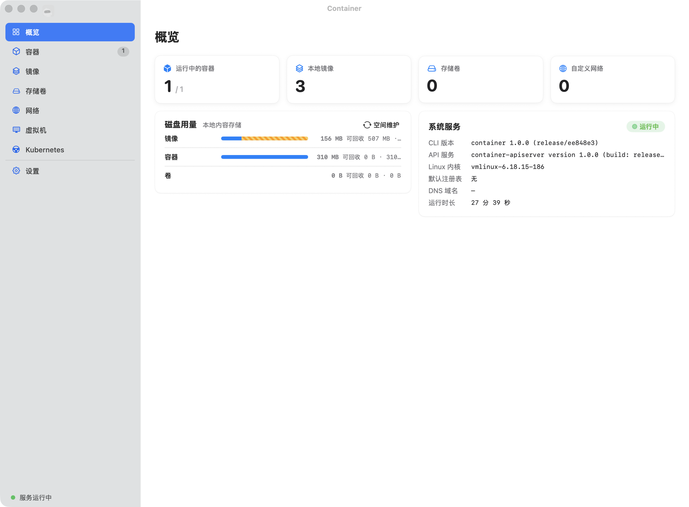

# Container GUI

A native macOS desktop client for Apple's [`container`](https://github.com/apple/container) CLI, built with AppKit and SwiftUI.



The app lets you manage containers, images, volumes, networks, machines, and Kubernetes clusters directly from a native window: run/pull/build images, inspect and stream container logs, watch live CPU/memory/network metrics, open a terminal, and manage local resources — all backed by the real `container` CLI (no mock data).

The `design/` folder is the browser-based visual prototype (HTML/JS/CSS) used as the design reference; `app/` is the production macOS application.

## Requirements

- macOS 15 or later
- Apple `container` CLI (auto-detected at `/usr/local/bin/container`, `/opt/homebrew/bin/container`, or `/usr/bin/container`)

## Build & Run

From `app/`:

```bash
./Scripts/dev.sh      # debug build + launch
# or
./Scripts/build.sh    # release build -> app/build/Container.app
open build/Container.app
```

## Features

- **Overview** — running counts, disk-usage bars (with reclaimable stripes), system service status & versions
- **Containers** — filter/search, start/stop/kill/delete, detail drawer with info · logs (follow/boot/tail) · monitoring charts · PTY terminal
- **Images** — pull, build, tag, push, save/load tar, layer history
- **Volumes** — create (size/journal mode), delete
- **Networks** — create (v4/v6/internal), delete, macOS 26 note
- **Machines** — create/configure/start/stop/set-default, shell & logs drawers
- **Kubernetes** — create clusters, load images, write kubeconfig (experimental)
- **Settings** — theme (auto/light/dark), language, service controls, kernel, DNS, registry logins, keyboard-shortcut rebinding
- Full localization (简体中文 / English) and light/dark appearance

## Project Structure

```
apple-container-gui/
├── app/                         # Production macOS app (Swift Package)
│   ├── Package.swift
│   ├── ContainerApp/            # Thin executable entry (main.swift)
│   ├── ContainerGUI/            # Library with all app logic
│   │   ├── App/                 # AppDelegate, main window, sidebar, icon, bootstrap
│   │   ├── Core/                # CLIRunner, Commands(+SystemCommands), Models(+SystemModels), Store, Keymap
│   │   ├── Features/            # One folder per resource domain (vertical slice)
│   │   │   ├── Overview/
│   │   │   ├── Containers/      # PageView + Commands + Models
│   │   │   ├── Images/  Volumes/  Networks/  Machines/  Kubernetes/  Settings/
│   │   ├── UI/                  # Shell / Overlays / Components / Theme / Support
│   │   └── Resources/           # en / zh-Hans localizations
│   ├── Tests/ContainerGUITests/ # Swift Testing tests
│   ├── ExceptionCatcher/        # Objective-C exception bridge
│   └── Scripts/                 # build.sh / dev.sh
├── design/                      # Browser visual prototype (design reference)
└── assets/                      # Screenshot / project assets
```

Each feature in `Features/` is a vertical slice: its SwiftUI page, typed CLI commands, and Codable models live together. Shared interaction UI (sheets, drawers, toasts, confirmations) lives under `UI/Shell` and `UI/Overlays`.

## Development

- Run `swift build` from `app/` for every change and smoke-test affected screens against the real CLI.
- Tests live in `app/Tests/ContainerGUITests` and use Swift Testing (`import Testing`); run `swift test` from `app/`. Model decoding and command parsing are covered there.
- User-facing strings use `L("key")` and must be added to both `en.lproj` and `zh-Hans.lproj` `Localizable.strings`.
- Page UI mirrors `design/`; keep view code in `UI/` or the relevant `Features/` folder.

## License

MIT
